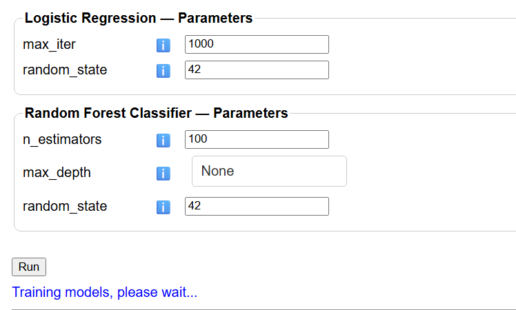
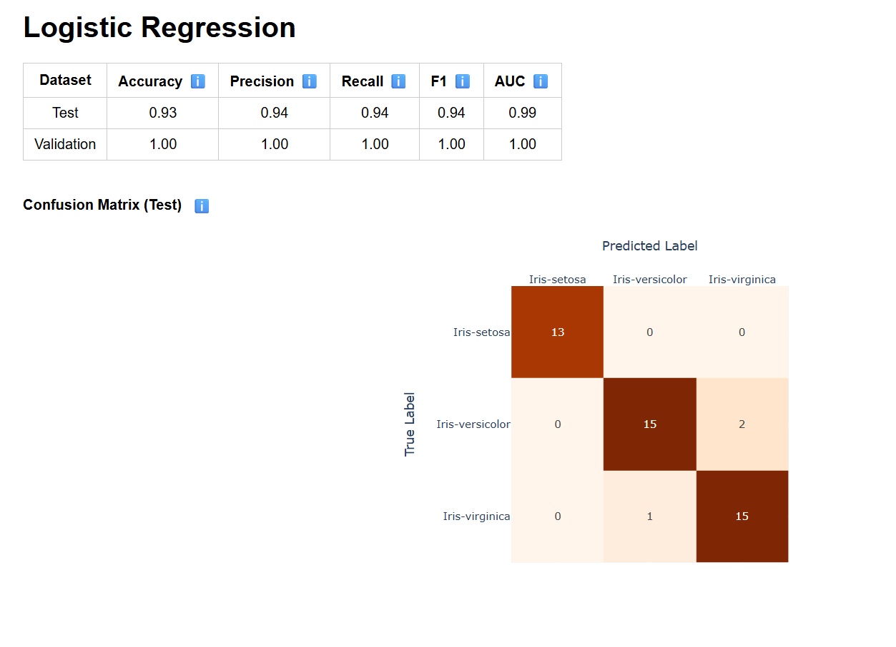

# Machine Learning Pipeline Dashboard
Interactive, beginner-friendly dashboard for exploring end-to-end machine learning pipelines without writing code.

# Overview
This project is a **Dash based web app** that lets you build, train, and evaluate machine learning models through an interactive dashboard.

It started as an education project for me to:
- Practice building ML Pipelines
- Applying topics I learned in class to an actual project
- Create a tool that helps people new to machine learning experimnt with different models, metrics and visualizations without touching code.
You upload a CSV, pick your target column, customize your preprocessing (split ratio, inclusion of validation set), choose Classification or Regression, select one or more models, optionally apply feature scaling or adjust parameters.
## Key Features
- **CSV Upload**
  - Upload a single CSV file with a header row
- **Target Column Selection**
  - Type the name of the target column
  - If left blank the dashboard automatically uses the last column in th edataset as the target.
-**Configurable Train/Test Split**
  - Choose the train/test ratio (70/30, 75/25, 80/20, 90/10)
  - Data is split into train and test sets using sckit-learn's train_test_split
-**Optional Validation Set**
  - Check a box to create a validation set (20% of the training portion)
- **Classification or Regression Mode**
  - Switch between
    - Classification
    - Regression
  -The list of available models updates automatically based on the chosen task
- **Multiple Models in One Run**
  - Select one or more models at the same time via a checklist
  - The app trains and evaluates each selected model and shows results one after another
- **Per-Model Feature Scaling**
  - Each model has its own scaler dropdown:
    - None
    - StandardScaler
    - MinMaxScaler
    - RobustScaler
    - MaxAbsScaler
  - Scaling is applied only to the models you choose, so you can see how scaling affects performance
- **Interactive Hyperparameter Controls**
  - For each model, a parameter panel appears with the most important hyperparameters:
      - Numeric fields (C, alpha, n_estimators, max_depth, etc)
      - Dropdown for choices(e.g., kernels, eval metics)
      - Checkboxes for boolean options
    - Each parameter has an ℹ️ help icon that explains what it does and how you would want to change it
- **Automatic Metrics & Visualizations**
  - The app computes appropriate metrics tables and plots for every model:
    - Classification: accuracy, precision, recall, F1, AUC + ROC curves, confusion matrices, multiclass ROC, feature importance
    - Regression: MSE, RMSE, MAE, R², Max Error, MAPE + predicted vs actual, residual plots, residual histograms.
  - All plots are rendered with Plotly inside the dashboard (and therefore can be adjusted for better visualization).
- **Educational Tooltips**
  - ℹ️ icons next to metrics, graphs, scalers,hyperparameters and models show friendly explanations and examples (e.g., what AUC means, how MAPE is interpreted, why scaling matters).
## Screenshots
### Upload & Configuration

## Hyperparameter Tuning

### Classification Results 

## Supported Models & Metrics
**Classification**
Classification Models (via scikit-learn & XGBoost):
  - Logistic Regression (logreg)
  - Random Forest Classifier (rf)
  - Support Vector Classifier (svc)
  - K-Nearest Neighbors Classifier (knnc)
  - Gaussian Naive Bayes (nb)
  - AdaBoost Classifier (adac)
  - XGBoost Classifier (xgbc)
**Classification Metrics**
-For each model, the app computes metrics on test (and optionally validation) data:
  - Accuracy
  - Precision
  - Recall
  - F1 Score
  - AUC (Area Under the ROC Curve)
-These metrics are displayed in a table with rows for Test and Validation and each metric has an explanatory tooltip
**Classification Plots**
  - Confusion Matrix Heatmap
    - Shows how often each class was correctly or incorrectly predicted
    - Dark diagonal = good; off-diagonal cells show where the model is confused.
  - ROC Curve
    - Plots True Positive Rate vs False Positive Rate at different thresholds.
    - Helps visualize the trade-off between sensitivity and specificity for binary problems
  - Multicalss ROC
    - One-vs-rest ROC curves for each class, useful to see which classes are easier or harder to distinguish
  - Feature Importance Bar Chart
**Regression**
- Regression Models (via scikit-learn & XGBoost):
  - Linear Regression (linreg)
  - Ridge Regression (ridge)
  - Lasso Regression (lasso)
  - Elastic Net (elastic)
  - Support Vector Regression (svr)
  - K-Nearest Neighbors Regressor (rfr)
  - XGBoost Regressor (xgbr)
- **Regression Metrics**
- For each regression model, the app computes:
  - MSE – Mean Squared Error
  - RMSE – Root Mean Squared Error
  - MAE – Mean Absolute Error
  - R^2 – Coefficient of determination
  - Max Error – Worst single prediction error
  - MAPE – Mean Absolute Percentage Error (when actual values are non-zero)
- **Regression Plots**
  - Predicted vs Actual Scatter Plot
    - Actual values on the x-axis, predicted values on the y-axis.
    - A diagonal “perfect prediction” line lets you quickly see if the model is systematically over- or under-predicting
  - Residuals Plot
    - Residuals (actual − predicted) vs predicted values
    - Random scatter around zero suggests a good fit; patterns may indicate bias or missing structure in the model
  - Residuals Histogram
    - Distribution of residuals to check if errors are centered near zero and roughly symmetric
## Tech Stack
  - Language: Python
  - Web Framework: Dash
  - Visualization: Plotly (Graph Object)
  - Data Handling: Pandas, NumPy
  - Machine Learning:
    - scikit-learn (models, metics, train'test split, scalers)
    - XGBoost(XGBClassifier, XGBRegressor)
  - Runs as a local web app in your browser served by Dash on localhost:8051
## Installation
1. Clone the repository
   - git clone https://github.com/22wthomp/Intro-To-ML-Helper.git
   - cd ml-pipeline-dashboard
2. Create and activate a virtual environment (recommended)
   - python -m venv .venv
   - Windows
      - .venv\Scripts\activate
    - macOS / Linux
      - source .venv/bin/activate
3. Install dependicies
   -pip install -r requirements.txt
   - (The project relies on Dash, Plotly, Pandas, NumPy, scikit-learn, XGBoost, etc., which should all be listed in requirements.txt.)
   
## Repository Structure
- `ml_pipeline.py` – Main Dash app
- `help_text.py` – Tooltip/help content for models, metrics, scalers, and parameters
- `data/` – Example datasets (recommended)
- `requirements.txt` – Project dependencies

## How to Use
1. Start the dashboard
  - from the project root:
    - python ml.pipline.py
  - The App will start a Dash server on port 8051:
    - URL: http://127.0.0.1:8051 (or http://localhost:8051)
2. Open in your browser
  - Visit http://localhost:8051 and you should see the "Machine Learning Pipeline Dashboard" interface
3. Typical Workflow
  1. Uplod a CSV
     - Click "Upload CSV" and choose a file
  2. Choose the Target Column
     - Enter the target column name (ex. label, price)
     - If you leave it blank, the last column of the CSV is treated as the target variable
  3. Configure Split & Validation
     - Choose a Train/Test split ratio (ex. 90/10, 80/20)
     - Optionally tick "Include validation set (20% of training): to create a validation set.
     - The app will show the number of rows in train, val, and test sets.
  4. Select Task Type
     - Choose Classification or Regression
     - The Model checklist updates automaically to show only compatible models
  5. Select Models
      - Check one or more models you want to train (ex. Logistic Regression + Random Forest)
      - For each selected model, a hyper parameter panel appears below
  6. Adjust Hyperparameters & Scalers (Optional)
      - For each model:
        - Use the ℹ️ icons to understand what each hyperparameter or metric means.
        - Adjust numeric values (ex. n-estimators, C, alpha)
        - Change categorical options (ex., SVC kernel, XGBoost eval metric)
        - Pick a feature scaler (None / Standard / MinMax / Robust / MaxAbs) or keep the default.
  7. Run the Pipeline
      - Click the Run Button
      - A “Training models, please wait...” message appears while models are training.
      - The app validates the dataset (missing values & numeric checks for regression), splits the data, scales features per model, trains each model, computes metrics, and generates plots.
  8. Interpret the Outputs
      - At the bottom, under “Data Info”, confirm your target choice and split sizes
      - Under “Model Results”, for each model you’ll see:
        - A metrics table for test (and validation, if enabled)
        - Relevant plots (confusion matrix, ROC/multiclass ROC, feature importance, predicted vs actual, residuals, residual histogram)
      - Use tooltips and visual diagnostics to learn how different models behave
**Internal Pipeline**
- CSV -> validation checks -> split -> per-model scaling -> train -> predict -> evaluate -> visualize
## Educational Notes
This dashboard is designed as a learning tool:
- Compare multiple models in one run to see real performance differences.
- Experiment with per model scaling to understand when preprocessing matters.
- Interpret visual diagnostics like ROC curves and residual plots to understand model behavior, not just scores.

## Current Limitation & Future Work 
- **Current Limitations**
- Based strictly on current code:
  - Data Cleaning Assumptions
    - The app checks for missing values and for non-numeric columns when performing regression. If issues are found, it reports them and refuses to run.
    - For best results, all feature columns should be numeric and free of missing values for both classification and regression
    - Preprocessing Scope
      - No automatic:
        - Categorical encoding (ex. one hot encoding)
        - Missing value imputation
        - Outlier handling
      - Scaling is the only preprocessing step
    - Model Tuning
      - Hyperparameters are configurable, but there is no automatic hyperparameter search (ex. GridSearchCV/RandomizedSearchCV)
      - Defaults are reasonable general purpose settings, but not tuned for any specific dataset.
- **Some Ideas To Add to this Project**
  - Prettyify General Application Look
  - Implement a Hyperparameter search (grid/random search) with visualizations of results
  - Allow saving and loading trained models/pipes
  - Add dataset preview
  - Provide premade example datasets from scikit-learn to try without uploading  files
  - Convert this to a fully web-based application
  - Add more graphs with the option to select which are displayed
  - Run different sets of models side by side
  - Add categorical encoding + missing value imputation
## Datasets

The example datasets used in this project are publicly available and were obtained from free sources. They are included only for educational/demo purposes and are not my original datasets.

